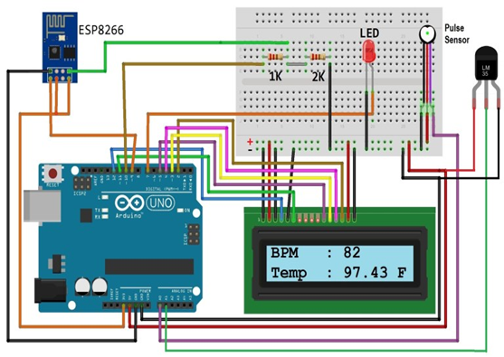

# Medical Examination using Hardware Aid
The project was initiated with a purpose of creating an efficient medical system. The Curative Assistance System is IOT based HealthCare System for monitoring all the body parameters like Heartbeat, ECG, BP etc. It provides  facility of accessing all the parameters at any time which is very useful for the doctors at the time of treatment. 

## 🔨 Basic Working
Health monitoring is the major problem in today’s world. Due to lack of proper health monitoring, patient suffer from serious health issues. 

This is a simple project that explains IoT Based Patient Health Monitoring System using ESP8266 & Arduino. Pulse Sensor and LM35 Temperature Sensors measures BPM & Environmental Temperature respectively. The Arduino processes the code and displays to 16*2 LCD Display. ESP8266 Wi-Fi module connects to Wi-Fi and sends the data to IoT device server. The IoT server used here is Thinkspeak. Finally the data can be monitored from any part of the world by logging into Thingspeak channel.

## Dependecies 

- Arduino
- Thinkspeak
- ESP8266
- NodeMCU (if one does not want arduino dependency)

## 📦 Install

Open the code Arduino software and save as '.ino' file, after downloading the required pacakages,like 'esp' in library.These pacakages are available on GitHub and other online platforms as per the choice of project builder. 

After saving the code and connecting the components together, run it and view the output on both 'Thinkspeak' and 'Arduino Serial Monitor'. 
